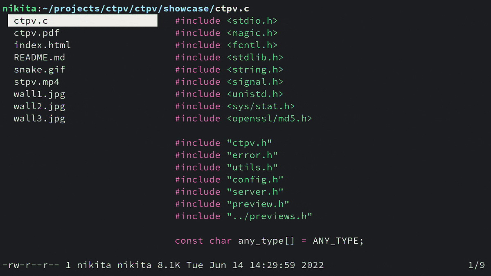

# ctpv

Terminal previewer



----

ctpv is a previewer utility for terminals.

It supports previews for source code, archives, PDF files, images
and videos (see [Previews](#previews)).

Image previews are powered by one of these:

* [Überzug](https://github.com/seebye/ueberzug) (X11 only)
* [Kitty terminal](https://github.com/kovidgoyal/kitty)
* [Chafa](https://github.com/hpjansson/chafa)

ctpv is a remake of an awesome program named
[stpv](https://github.com/Naheel-Azawy/stpv)
written in C.
stpv worked perfectly for me, except it was kinda sluggish because
it was written in POSIX shell.
ctpv is an attempt to make a faster version of stpv and add some
new features.

Originally it was made for [lf]
file manager but I believe that it can be easily integrated into
other programs as well
(either via configuration file like in lf or a simple wrapper
script).

## Dependencies

### Libraries

* `libcrypto`
* `libmagic`

### Previews

Previewing each file type requires specific programs.
If a program is not found on the system, ctpv
will try to use another one.
Only one program is required for each file type.
For example, you only need either `elinks`, `lynx` or
`w3m` installed on your system to view HTML files.

<!-- This table is auto generated! -->
<!--TABLESTART-->
| File types | Programs |
| ---- | ---- |
| any | `exiftool` `cat` |
| archive | `atool` |
| audio | `ffmpegthumbnailer` `ffmpeg` |
| diff | `colordiff` `delta` `diff-so-fancy` |
| directory | `ls` |
| font | `fontimage` |
| gpg-encrypted | `gpg` |
| html | `elinks` `lynx` `w3m` |
| image | `ueberzug` `chafa` |
| json | `jq` |
| markdown | `mdcat` |
| office | `libreoffice` |
| pdf | `pdftoppm` |
| svg | `convert` |
| text | `bat` `cat` `highlight` `source-highlight` |
| torrent | `transmission-show` |
| video | `ffmpegthumbnailer` |

<!--TABLEEND-->

## Installation

### Manual

```sh
git clone https://github.com/NikitaIvanovV/ctpv
cd ctpv
sudo make install
```

Uninstall with `sudo make uninstall`

### AUR

If you are an Arch Linux user, you can install
[`ctpv-git`](https://aur.archlinux.org/packages/ctpv-git)
AUR package.

```sh
yay -S ctpv-git
```

## Integration

### lf file manager

Add these lines to your lf config
(usually located at `~/.config/lf/lfrc`).

```
set previewer ctpv
set cleaner ctpvclear
&ctpv -s $id
&ctpvquit $id
```

## Documentation

Full documentation on command line options,
configuration and how to define custom previews can be found here:
https://nikitaivanovv.github.io/ctpv/

[lf]: https://github.com/gokcehan/lf
